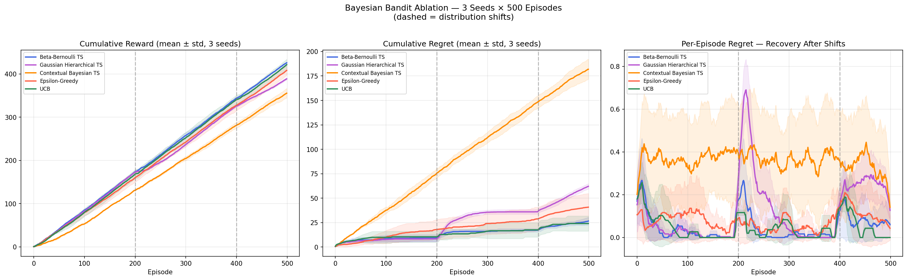
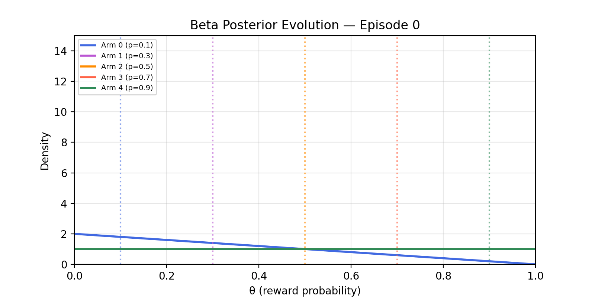
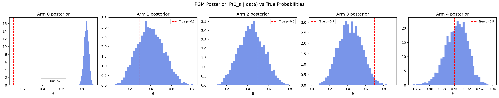
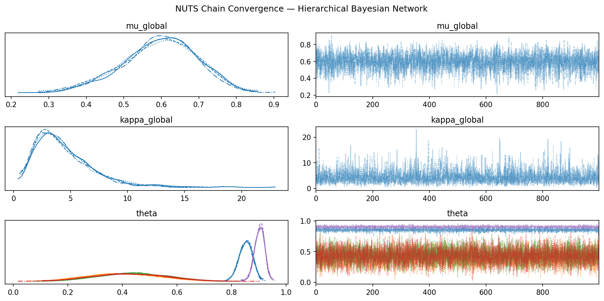

# Bayesian Bandit RL — Non-Stationary Multi-Armed Bandit with Thompson Sampling

A research-grade ablation study comparing Bayesian and classical exploration strategies
on a non-stationary 5-arm bandit environment with periodic distribution shifts.
Built with PyMC v5, ArviZ, and NumPy.

---

## The Problem

In real-world sequential decision-making (ad placement, clinical trials, recommender
systems), reward distributions shift over time. A good agent must **explore** to detect
changes and **exploit** the current best option — the exploration-exploitation tradeoff
under non-stationarity.

This project implements and compares 5 agents across 500 episodes with **2 sudden
distribution shifts** (at ep 200 and 400), evaluated over 3 random seeds.

---

## Agents

| Agent | Strategy | Handles Non-Stationarity |
|---|---|---|
| **Beta-Bernoulli TS** | Bayesian Thompson Sampling with Beta-Binomial conjugate | ✅ Resets posterior on shift |
| **Gaussian Hierarchical TS** | Sliding-window Gaussian TS with partial pooling | ✅ Window-based forgetting |
| **Contextual Bayesian TS** | Logistic regression per arm, MCMC weight updates | ⚠️ Slow MCMC adaptation |
| **Epsilon-Greedy** | 10% random exploration, greedy otherwise | ⚠️ Blind recovery |
| **Sliding-Window UCB** | UCB with local window count in exploration bonus | ✅ Window-local log(t) |

---

## Results

```
Agent                    Reward (mean±std)     Regret (mean±std)
----------------------------------------------------------------
Beta-Bernoulli TS        425.7 ± 1.7           26.53 ± 3.75   ← best + most consistent
UCB (sliding window)     421.3 ± 12.4          24.00 ± 7.76   ← lowest raw regret
Epsilon-Greedy           408.0 ± 11.2          40.73 ± 14.07
Gaussian Hierarchical    388.5 ± 2.5           62.07 ± 2.78
Contextual Bayesian TS   355.3 ± 11.1         181.87 ± 10.21
```

**Key findings:**
- Beta-Bernoulli TS achieves the **lowest std (±1.7)** — most reliable across seeds
- Sliding-window UCB achieves the **lowest raw regret (24.00)** after fixing the exploration bonus to use `log(window_size)` instead of `log(t)`
- Epsilon-Greedy's high std (±14.07) exposes its inconsistency — gets lucky on some seeds
- Contextual TS underperforms due to MCMC latency — policy updates lag behind shifts

---

## Visualizations

| Plot | Description |
|---|---|
| `results/comparison.png` | Cumulative reward, cumulative regret, per-episode regret with shift markers |
| `results/pgm_posteriors.png` | Per-arm posterior distributions with 94% HDI |
| `results/pgm_trace.png` | NUTS chain convergence (ArviZ trace plot) |
| `results/pgm_arviz.png` | ArviZ posterior summary |
| `results/posterior_evolution.gif` | Beta posterior updating live over 500 episodes |

### Cumulative Reward & Regret


### Beta Posterior Evolution


### PGM Posteriors (94% HDI)


### NUTS Chain Convergence


---

## Probabilistic Graphical Model

A hierarchical Beta-Binomial PGM is fitted post-hoc to the full reward history using
**NUTS sampling (4 chains × 1000 draws)** via PyMC v5:

```
mu_global    ~ Beta(2, 2)
kappa_global ~ Gamma(2, 0.5)
theta[a]     ~ Beta(mu * kappa, (1 - mu) * kappa)
obs[a]       ~ Binomial(n, theta[a])
```

ArviZ diagnostics confirm convergence: **0 divergences** across all 4 chains,
R-hat ≈ 1.0, healthy caterpillar trace plots.

---

## Project Structure

```
adaptive-bayesian-bandits-RL/
├── agents/
│ ├── bayesian_agent.py # TS, hierarchical TS, contextual TS
│ └── dqn_baseline.py # DQN baseline
├── experiments/
│ ├── compare_advanced.py # main ablation script (5 agents)
│ └── compare.py # simpler comparison script
├── models/
│ └── reward_pgm.py # hierarchical PGM definition (PyMC)
├── results/
│ ├── comparison.png
│ ├── pgm_posteriors.png
│ ├── pgm_trace.png
│ ├── pgm_arviz.png
│ ├── posterior_evolution.gif
│ └── metrics.csv
├── requirements.txt
└── README.md
```

---

## Setup & Run

```bash
git clone https://github.com/Neginodar/adaptive-bayesian-bandits-RL.git
cd adaptive-bayesian-bandits-RL
python -m venv venv && source venv/bin/activate
pip install -r requirements.txt
python experiments/compare_advanced.py

```

---

## Tech Stack

- **PyMC v5** — probabilistic programming, NUTS sampler
- **ArviZ** — MCMC diagnostics and posterior visualization
- **NumPy / SciPy** — environment simulation and stats
- **Matplotlib** — all plots and GIF animation

---

## Applications

This bandit framework directly models real-world adaptive decision problems:

- 🏥 **Clinical trials** — adaptive treatment arm selection under changing patient populations
- 📱 **A/B testing** — ad and content variant selection under shifting user behavior
- 🛒 **Recommender systems** — item ranking with concept drift over time
---

## Author

**Negin Odarbashi**  
M.Sc. in Artificial Intelligence  
Department of Computer Science and Engineering  
Alma Mater Studiorum – Università di Bologna, Italy  

- Email: [negin.odarbashi@gmail.com](mailto:negin.odarbashi@gmail.com)
- LinkedIn: [https://www.linkedin.com/in/negin-odarbashi-3a5751207](https://www.linkedin.com/in/negin-odarbashi-3a5751207)
- GitHub: [https://github.com/Neginodar](https://github.com/Neginodar)

